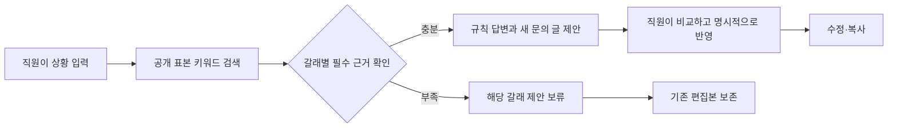

# 직원 업무 도우미 · Employee Assistant

직원이 장비 정책을 확인하고 문의 글을 준비하는 로컬 웹 앱이다. 공개 정책 표본을 검색해 **답할 수 있는 내용과 아직 확인하지 못한 내용을 나누고**, 직원이 직접 고친 글을 보존하면서 새 제안을 선택적으로 반영한다.

현재 지원하는 장면은 **재택용 모니터 구입과 느려진 회사 노트북 교체를 함께 문의하는 경우**다. 검색어·근거 역할·답변 문구는 수동 규칙으로 정한다. 실제 LLM/API 호출, 자유 질문 해석, 임베딩·벡터 검색은 연결하지 않았다.

## 실제로 동작하는 흐름



- **A · 정책 읽기**에서는 답과 이번 요청에서 실제로 회수한 원문을 함께 읽는다. **B · 문의 작성**에서는 문의 글을 넓게 펼쳐 수정한다.
- 노트북 핵심 절을 검색 자료에서 제외하면 모니터 결과는 유지하고 IT의 새 제안만 보류한다. 검색된 문서가 있다는 이유만으로 필요한 근거가 모두 있다고 판단하지 않는다.
- 재직기간이나 구매 상태를 고치면 이전 제안을 반영할 수 없게 표시한다. 새 제안을 만들어도 작성 중인 글은 유지하며, **현재 제안 반영하기**를 눌렀을 때만 교체한다.
- 늦은 응답은 현재 입력과 대조한다. 통신 실패·근거 부족·복구·A/B 이동도 편집본을 자동으로 덮어쓰지 않는다.
- 개인 잔액·실제 승인·묶음 신청 가능 여부는 미확인으로 남긴다. 실제 신청·발송이나 내부 시스템 조회는 하지 않는다.

## 실행

Python **3.10 이상**과 브라우저가 필요하다. 앱 런타임은 Python 표준 라이브러리만 사용한다.

```sh
git clone https://github.com/junhyun-dev/employee-assistant.git
cd employee-assistant
python3 -m employee_assistant --port 8767
```

브라우저에서 <http://127.0.0.1:8767/>을 연다. 서버는 `127.0.0.1`에만 바인딩하며, 실행 시 외부 모델이나 정책 사이트에 요청하지 않는다. 참고 문서 링크를 직접 열면 외부 GitLab 페이지로 이동한다.

‘검색 자료 확인’의 **노트북 핵심 표본 제외** 버튼으로 부분 근거 누락을 확인할 수 있다. 이는 고정 표본의 일부를 제외하는 개발 확인 동작이며 실제 정책 부재나 신청 거절이 아니다.

입력·문의 글은 브라우저 메모리에만 있다. **새로고침하면 초기화되므로 보관할 글은 복사해야 한다.** 데이터베이스·계정·문의 기록 저장은 없다.

## 구현 구성

| 위치 | 역할 |
|---|---|
| [flow.py](employee_assistant/flow.py) | 지원 문의의 키워드 검색, 갈래별 근거 역할 판정, 규칙 답·제안, 편집본 상태 |
| [server.py](employee_assistant/server.py) | 로컬 HTTP와 JSON 입력 경계, 정적 파일 제공 |
| [web/](web/) | A/B 화면, 입력 판본·응답 순서 처리, 편집·명시 반영·복사 |
| [공개 정책 표본](data/gitlab-expenses-excerpts.json) | 출처·관찰 시각·추출 범위를 포함한 6개 부분 발췌 |
| [model_contract.py](employee_assistant/model_contract.py) | 향후 모델 비교를 위한 입력 조립·합성 반환 검사. 현재 UI의 실행 경로와 별개 |

`model_contract.py`는 직원 입력과 회수 원문을 지시문과 구별하고, 이번 입력 밖의 근거 ID·필수 갈래 누락·근거 부족에서 완성한 답·상태 변경 필드를 거부한다. 조립된 입력의 내용을 다시 해시해 판본 불일치도 잡는다. 검증된 반환도 편집본과 별개 제안이다.

이 검사는 **구조와 근거 ID 포함 여부**를 확인한다. 문장이 원문 조건을 올바르게 해석했는지, 명령 주입에 모델이 저항하는지, 실제 생성 품질이 좋은지는 검증하지 않았다. 입력 해시는 일관성 검사이며 서명·인증이 아니다. 모델 공급자 연결과 모델 반환의 화면 적용은 아직 구현하지 않았다.

## 검증

표준 라이브러리만으로 단위·HTTP·계약 검사를 실행한다.

```sh
python3 -m unittest discover -s tests -p 'test_*.py' -v
```

현재 **18개 검사**에서 사실 정정 후 편집본 보존, 부분 근거 누락, 요청별 근거 ID, 잘못된 JSON 값, 정적 경로 경계, 오래된 모델 입력·제안 거부 등을 확인한다. 모델 계약 검사는 규칙 출력과 합성 반환을 사용한다.

브라우저 검사는 별도의 Playwright 환경이 필요하다. 가상환경에서 설치한 뒤 앱을 실행한 상태로 검사한다.

```sh
python3 -m venv .venv
# Windows에서는 .venv\Scripts\activate
. .venv/bin/activate
python3 -m pip install playwright
python3 -m playwright install chromium
python3 tests/browser_flow.py --base-url http://127.0.0.1:8767 --output test-results/browser
```

브라우저 검사는 입력 정정·명시 반영·직접 편집·근거 누락과 복구·복사 내용·통신 실패·늦은 응답·HTML 형태의 입력·A/B 이동·모바일 가로 넘침을 확인한다. 캡처는 지정한 결과 폴더에 생성하며 저장소에는 포함하지 않는다. 검사 통과는 실제 직원의 사용성 평가나 임의 질문의 정확도 측정이 아니다.

## 데이터 출처와 라이선스

[GitLab Global Travel and Expense Policy](https://handbook.gitlab.com/handbook/finance/expenses/)의 작은 고정 표본을 사용한다. 전체 정책·최신 정책 동기화·조직별 적용을 지원하는 데이터셋이 아니다. 직원 조건과 테스트 입력은 합성 예시이며 실제 직원 정보를 포함하지 않는다.

Handbook 원본 저장소의 MIT 라이선스와 출처에 따라 원저작권·허가문을 보존했다. 발췌·변환 범위와 고정 원문 링크는 [THIRD_PARTY_NOTICES.md](THIRD_PARTY_NOTICES.md)에 있다. GitLab과 제휴하거나 GitLab이 승인한 서비스가 아니다.

이 프로젝트의 독자 코드에는 별도의 소프트웨어 라이선스를 아직 부여하지 않았다. 제3자 자료의 라이선스를 프로젝트 전체에 적용한 것으로 해석하지 않는다.

## 현재 한계

지원 문의 유형, 한영 대응어, 필수 근거 역할과 답변 문구를 사람이 정한 기준선이다. 임의 질문의 의도나 근거 완전성을 자동으로 알아내지 않는다. 실제 LLM 생성·의미 평가, 여러 조직의 정책, 인증·권한, 저장·발송, 운영 배포는 포함하지 않는다.

다음 비교 대상은 같은 검색 결과를 제공했을 때 모델이 규칙 기준선보다 유용한 답과 문의 글을 만드는지다. 현재 저장소는 그 비교 전의 로컬 구현과 입력·반환 계약 검증을 담고 있다.
