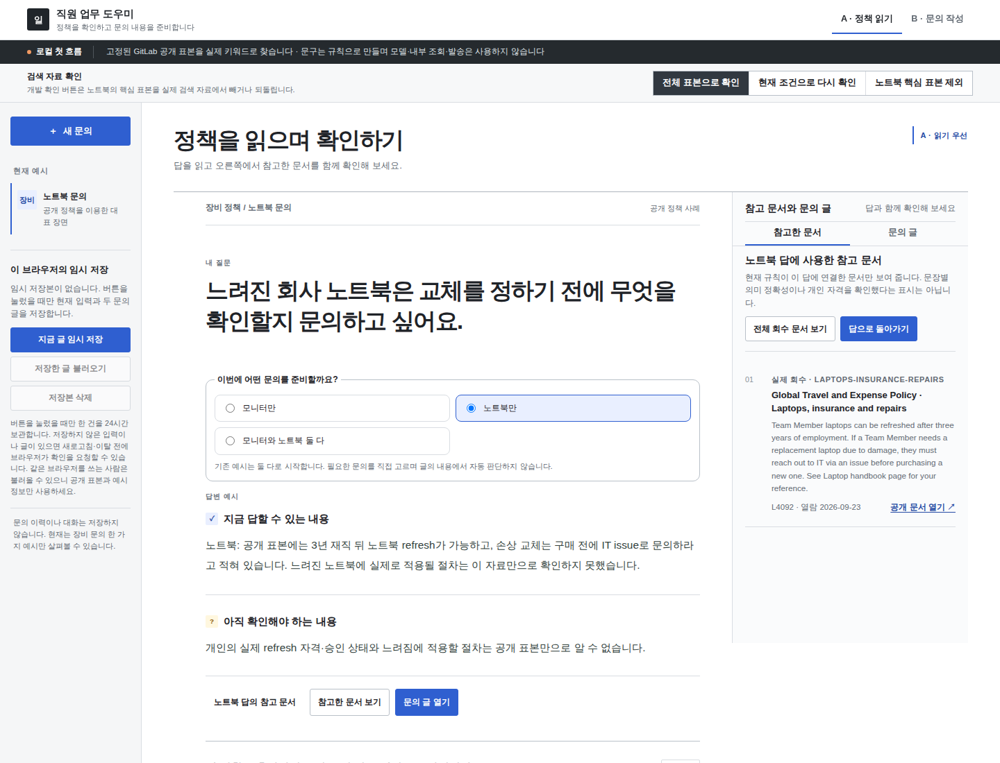
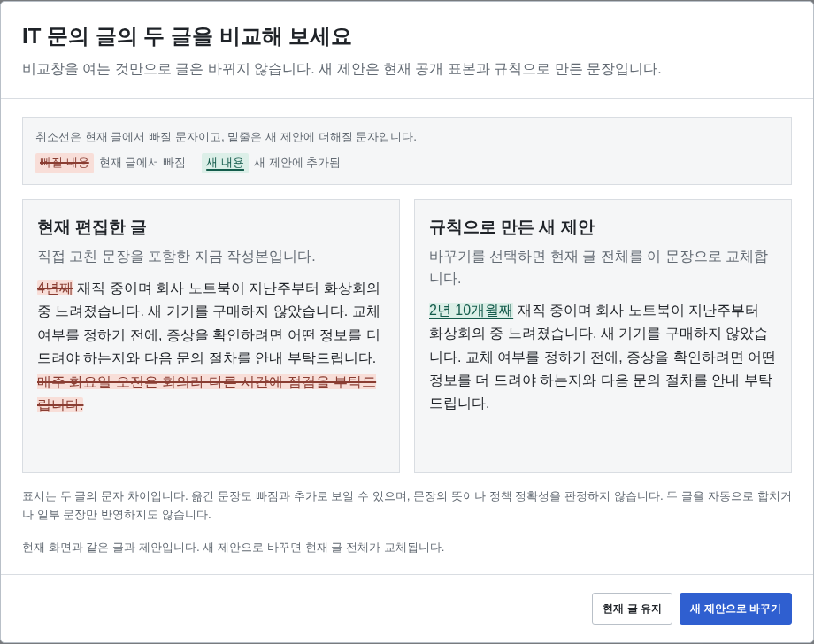
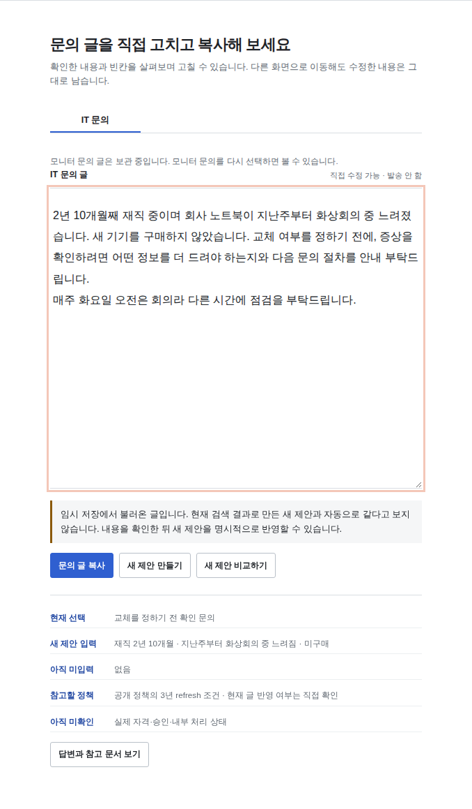

# 직원 업무 도우미 · Employee Assistant

Employee Assistant는 **사내 정책과 절차를 바탕으로 직원의 업무 문의를 돕는 프로젝트**입니다. 직원이 상황을 설명하면 필요한 정보를 함께 정리하고, 담당 팀에 전달할 문의 글까지 작성하는 대화형 도우미를 목표로 합니다.

문서를 찾는 것에서 한 걸음 더 나아가, 무엇을 문의할지와 어떤 내용을 전달할지를 함께 구체화하려고 합니다. 직원은 제안된 글의 근거를 확인하고 자신의 상황에 맞게 수정해 다음 업무를 준비합니다.

## 현재 구현

첫 구현 대상으로 장비 문의를 선택했습니다. 현재 앱에서는 모니터 구입과 회사 노트북 문의의 목적을 직접 고르고, 다음 흐름을 사용할 수 있습니다.

- **정책 확인:** 선택한 문의에 관련된 문서를 검색하고, 안내와 함께 출처를 읽습니다.
- **문의 글 작성:** 입력한 사실로 만든 초안을 직접 고칩니다. 새 제안이 생기면 기존 글과 비교해 바꿀 내용을 확인합니다.
- **이어 쓰기:** 수정한 글을 복사하거나 브라우저에 임시 저장하고, 다시 열어 작업을 이어갑니다.

현재 답과 초안은 GitLab의 공개 정책 발췌, 키워드 검색과 정해진 문구로 만듭니다. 자유로운 대화 이해와 LLM 생성은 앞으로 연결할 부분입니다.



위 화면은 첫 사용 예인 노트북 문의에서 답과 참고한 정책을 함께 읽는 모습입니다. 화면에는 공개 정책 표본과 가상의 직원 정보를 사용했습니다. 이미지를 누르면 큰 크기로 볼 수 있습니다.

[실행](#실행) · [직접 사용해 보기](#try-one-inquiry) · [설계와 코드](#read-code) · [발전 방향](#다음-발전-방향) · [테스트](#검증)

## 실행

Python 3.10 이상과 브라우저가 필요합니다. 앱 실행에는 Python 표준 라이브러리만 사용합니다. 최신 기능은 `draft-resume` 브랜치에 있으며, 기본 브랜치인 `main`은 초기 버전입니다.

```sh
git clone --branch draft-resume --single-branch https://github.com/junhyun-dev/employee-assistant.git
cd employee-assistant
python3 -m employee_assistant --port 8767
```

브라우저에서 <http://127.0.0.1:8767/>을 엽니다. 종료하려면 터미널에서 `Ctrl+C`를 누릅니다. 서버는 로컬 주소에서만 접속할 수 있습니다. 앱 실행 중 외부 API를 호출하지 않으며, 참고 문서 링크를 직접 열 때만 GitLab 사이트로 이동합니다.

<a id="try-one-inquiry"></a>
<a id="한-문의를-처음부터-이어-써-보기"></a>
## 직접 사용해 보기

앱은 모니터와 노트북 문의 예시로 시작합니다. 위 화면부터 아래 비교창과 복원한 글까지, 같은 노트북 문의를 이어서 작성해 보세요.

### 1. 문의를 고르고 정책 읽기

**노트북만**을 고르고, 목적을 **교체를 정하기 전에 무엇을 확인할지 문의하기**로 바꿉니다. **A · 정책 읽기**에서 **예시 정보 넣기**를 누르면 재직기간 `4년`, 느려진 상황 `지난주부터 화상회의 중`, 구매 상태 `아직 구매하지 않음`이 채워집니다.

답 아래의 **노트북 답의 참고 문서**를 눌러 위 화면처럼 원문을 읽습니다. 일반적인 교체 조건과 개인에게 적용할 절차가 아직 확인되지 않았다는 안내를 구별해서 볼 수 있습니다.

### 2. 직접 고친 글과 새 제안 비교하기

**문의 글 열기**로 IT 문의 글을 엽니다. **새 제안 비교하기**에서 **새 제안으로 바꾸기**를 눌러 `4년` 예시를 반영하고, 끝에 `매주 화요일 오전은 회의라 다른 시간에 점검을 부탁드립니다.`를 덧붙입니다.

재직기간을 `2년 10개월`로 고친 뒤 **새 제안 만들기**, **새 제안 비교하기**를 누릅니다. 기간은 바뀌지만, 직접 적은 일정 요청은 새 제안에 없다는 것을 볼 수 있습니다. **현재 글 유지**를 누르면 기존 글을 그대로 두고 비교창을 닫습니다.



### 3. 수정한 글을 저장하고 다시 열기

기존 글의 `4년`만 직접 `2년 10개월`로 고치고 일정 요청은 남깁니다. **B · 문의 작성**으로 이동해 **지금 글 임시 저장**을 누릅니다. 새로고침한 뒤 **저장한 글 불러오기**를 선택하고 확인하면 아래처럼 작성한 글로 돌아옵니다.



복원한 글은 새 검색 결과로 자동 교체되지 않습니다. **문의 글 복사**를 누르면 현재 입력과 가져갈 글을 확인한 뒤 복사할 수 있습니다. 저장본은 같은 브라우저 프로필과 주소·포트에서만 다시 열 수 있습니다. 자세한 보관 범위는 [저장하고 이어 쓰기](#draft-resume)에 설명했습니다.

**B · 문의 작성**으로 전환하면 같은 글을 더 넓은 편집 화면에서 고칠 수 있습니다. A와 B는 동일한 입력과 글을 보여 주는 두 가지 배치입니다.

근거가 빠졌을 때의 동작은 화면 위 **노트북 핵심 표본 제외**로 확인할 수 있습니다. 노트북의 새 답과 초안은 보류되지만 작성 중인 글은 남습니다. **전체 표본으로 확인**을 누르면 다시 검색합니다. 이 버튼은 테스트용 자료를 일부 빼는 기능입니다.

<a id="실제로-동작하는-흐름"></a>
## 문의를 작성할 때 할 수 있는 일

<a id="inquiry-scope"></a>
### 필요한 문의만 고르기

모니터만, 노트북만, 둘 다 중 하나를 고르면 해당 문의의 답과 참고 문서, 편집글을 볼 수 있습니다. 선택에서 빠진 글은 지우지 않으며 다시 선택하면 그대로 돌아옵니다. 임시 저장에는 화면에 보이지 않는 글도 함께 들어갑니다.

<a id="inquiry-purpose"></a>
<a id="노트북-문의-목적을-고르기"></a>
<a id="minimal-inquiry"></a>
<a id="입력한-사실만으로-it-문의-준비하기"></a>
<a id="monitor-inquiry"></a>
<a id="모니터-안내와-개인-적용-구별하기"></a>
### 아는 내용부터 적기

노트북 문의는 교체 전에 무엇을 확인할지 묻는 글과 교체 절차를 묻는 글을 나누어 제공합니다. 재직기간이나 구매 상태를 아직 입력하지 않아도 초안을 만들 수 있습니다. 빈 정보는 문장에서 생략하고, 구매 여부를 모른다고 직접 선택한 경우에는 그 사실을 글에 남깁니다.

모니터 문의에서는 승인 품목과 일반 수당 안내를 보여 줍니다. 개인에게 적용되는 수당이나 남은 금액은 담당 팀에 확인하도록 문의 글에 담습니다. 노트북용으로 입력한 재직기간 등을 모니터 초안에 자동으로 넣지는 않습니다.

<a id="진행-중-답에서-참고한-정책-절로-이동하기"></a>
<a id="답에서-참고한-정책-절로-이동하기"></a>
### 답에 사용한 문서 읽기

**참고 문서 보기**를 누르면 해당 답에 연결된 정책 절의 원문과 공개 링크를 볼 수 있습니다. **답으로 돌아가기**로 읽던 위치에 돌아옵니다. 필요한 정책 절이 없으면 그 문의의 새 답과 초안을 보류합니다. 직원이 적지 않은 정보와 답을 뒷받침할 문서가 없는 경우를 다르게 처리합니다.

<a id="진행-중-새-제안을-반영하기-전에-비교하기"></a>
<a id="새-제안을-반영하기-전에-비교하기"></a>
### 새 초안을 비교하고 글 가져가기

새 제안과 작성 중인 글을 나란히 보고, 빠지는 내용은 취소선으로, 추가되는 내용은 밑줄로 확인합니다. **현재 글 유지**로 취소하거나 **새 제안으로 바꾸기**로 글 전체를 교체합니다. 직접 추가한 요청도 교체 과정에서 사라질 수 있으므로 자동으로 합치지 않습니다. 긴 글에서는 세부 표시 대신 두 글 전체를 보여 줍니다.

평소에는 수정한 글을 바로 복사할 수 있습니다. 입력이나 근거가 바뀌었거나 검색에 실패한 경우에는 복사 전에 다시 확인할 내용을 보여 줍니다. 앱은 글과 상태의 변경 여부를 확인하고, 문장이 맞는지는 사람이 읽고 판단합니다. 실제 문의 발송은 지원하지 않습니다.

<a id="초안-이어쓰기--구현-중"></a>
<a id="draft-resume"></a>
<a id="초안-이어쓰기"></a>
<a id="진행-중-미저장-변경을-두고-떠날-때"></a>
<a id="미저장-변경을-두고-떠날-때"></a>
### 저장하고 이어 쓰기

**지금 글 임시 저장**을 눌렀을 때만 선택한 문의와 목적, 입력한 내용, 두 편집글을 브라우저에 한 건 저장합니다. 마지막 저장 후 24시간 안에 불러올 수 있으며, 읽거나 복원해도 보관 시간이 늘어나지 않습니다. 만료된 내용은 앱이 다시 접근할 때 삭제합니다. 자동저장은 아니므로 저장 이후에 고친 부분은 다시 저장해야 합니다.

저장본을 찾으려면 같은 브라우저 프로필과 주소·포트를 사용해야 합니다. 다른 탭이 저장본을 먼저 바꿨다면 오래된 내용으로 덮어쓰지 않도록 알려 줍니다. **새 문의**는 현재 화면만 초기화하고, **저장본 삭제**는 저장본만 지웁니다.

**로그인이나 사용자별 저장 보호는 없습니다.** 같은 브라우저를 공유하는 사람도 글을 불러올 수 있으므로 공개 예시로 사용하고, 회사 정보나 민감한 내용을 저장하지 않는 편이 좋습니다. 서버 백업도 제공하지 않습니다. 미저장 수정이 있으면 브라우저에 이탈 확인을 요청하지만, 모바일 강제 종료 등에서는 확인창이 뜨지 않을 수 있습니다.

<a id="read-code"></a>
<a id="같은-문의에서-데이터와-코드-읽기"></a>
<a id="구현-구성"></a>
## 설계와 코드 읽기

### 검색한 문서가 있다고 곧바로 답하지 않는다

[flow.py](employee_assistant/flow.py)는 문의 종류에 맞춰 공개 표본을 키워드로 검색하고, 답에 필요한 정책 절이 있는지 확인합니다. 선택하지 않은 문의와 선택했지만 근거가 부족한 문의를 구별합니다. 예를 들어 모니터만 선택했다면 노트북 절이 없어도 모니터 안내는 계속할 수 있습니다. 이 판단은 미리 정한 규칙에 따르며 임의 질문의 근거가 충분한지 알아내는 기능은 아닙니다.

### 새 제안과 직원이 고친 글을 따로 둔다

재직기간을 고쳤다고 초안을 즉시 교체하면 직원이 덧붙인 일정 요청까지 잃게 됩니다. [app.js](web/app.js)는 입력, 새 제안, 편집글을 따로 관리합니다. 검색 응답이 늦게 도착하거나 비교창을 연 뒤 입력이 바뀌면 오래된 제안을 적용하지 않습니다. [text_diff.js](web/text_diff.js)는 비교할 두 글의 문자 차이를 계산합니다.

[draft_store.js](web/draft_store.js)는 IndexedDB에서 저장본을 읽었을 때의 버전과 현재 버전을 한 트랜잭션 안에서 비교한 뒤 저장·삭제합니다. 이전 형식의 저장본도 읽을 수 있으며 복원만으로 원래 내용이나 저장 시각을 다시 쓰지 않습니다. 지원하지 않는 형식은 자동으로 지우지 않습니다. 관련 사례는 [저장·복원 검사](tests/draft_resume_flow.py)에 있습니다.

### 모델을 연결할 자리와 현재 실행을 구별한다

[server.py](employee_assistant/server.py)는 로컬 HTTP 요청과 입력 형식을 처리합니다. 현재 화면의 답과 초안은 `flow.py`의 규칙으로 만듭니다. 별도의 [model_contract.py](employee_assistant/model_contract.py)는 향후 모델에 전달할 입력과 반환 형식을 검사하는 코드입니다. 요청에 없는 근거 ID, 오래된 입력으로 만든 제안, 근거가 부족한데 작성한 답 등을 거부합니다. 실제 모델 호출이나 답 문장의 의미 정확성 검사는 구현하지 않았습니다.

## 다음 발전 방향

장비 문의에서 만든 검색과 편집 흐름을 바탕으로, 직원이 상황을 설명하는 단계부터 문의 글을 완성하는 단계까지 연결하려고 합니다.

- **문서 준비와 검색:** 정책의 출처와 적용 조건을 유지하면서 검색할 단위를 정리하고, 다른 질문 표현에서도 필요한 근거를 찾는지 살펴봅니다.
- **문의 목적 구체화:** 지금의 목적 선택을 출발점으로, 직원이 이미 말한 내용을 다시 묻지 않고 요청을 바꾸는 정보만 확인하는 대화를 설계합니다.
- **근거에 따른 생성과 평가:** 찾은 문서와 직원의 사실을 모델 입력에 연결하고, 규칙으로 만든 글과 비교해 설명이 나아지는지, 정책을 잘못 적용하거나 개인 사실을 만들어 내지는 않는지 평가하려고 합니다.

이는 앞으로 검토할 개발 방향입니다. 현재는 모델 없이 동작하는 앱까지 구현했으며, 외부 모델 API를 사용하는 비교 실험은 보류 중입니다.

## 검증

단위 테스트는 별도 패키지 없이 실행할 수 있습니다.

```sh
python3 -m unittest discover -s tests -p 'test_*.py' -v
```

현재 38개 테스트가 문의 선택, 빠진 입력, HTTP 오류 처리, 모델 입력·반환 형식 등을 다룹니다. 모델 관련 테스트는 실제 생성 대신 합성 반환값을 사용합니다.

[브라우저 테스트](tests/browser_flow.py)는 글 편집과 제안 비교, 복사, 근거 누락, 늦은 응답, A/B 화면과 모바일 표시를 확인합니다. [저장 테스트](tests/draft_resume_flow.py)는 재열기, 두 탭의 동시 수정, 저장 실패, 이전 형식 복원 등을 다룹니다. 테스트에는 별도 브라우저 프로필과 가상 직원 정보를 사용합니다.

<details>
<summary>Playwright 브라우저 테스트 실행법</summary>

앱 서버를 실행한 상태에서 다른 터미널을 열고 다음을 실행합니다.

```sh
python3 -m venv .venv
# Windows에서는 .venv\Scripts\activate
. .venv/bin/activate
python3 -m pip install playwright
python3 -m playwright install chromium
python3 tests/browser_flow.py --base-url http://127.0.0.1:8767 --output test-results/browser
python3 tests/draft_resume_flow.py --base-url http://127.0.0.1:8767 --output test-results/draft-resume
```

실행 결과와 캡처는 `test-results/`에 저장되며 Git에 포함하지 않습니다.

</details>

## 현재 한계

현재 버전은 준비된 장비 정책 표본을 사용하는 로컬 앱입니다. 전체 정책 검색이나 최신 정책 자동 갱신, 개인 수당·승인 상태 조회, 실제 발송과 기업 배포는 지원하지 않습니다. 테스트로 확인한 앱 동작과 별개로, 실제 직원의 사용성과 답 문장의 정책 해석 정확성은 추가 평가가 필요합니다.

## 데이터 출처와 라이선스

[GitLab Global Travel and Expense Policy](https://handbook.gitlab.com/handbook/finance/expenses/)에서 발췌한 6개 정책 절을 사용합니다. 직원 정보는 가상의 예시이며, GitLab과 제휴하거나 승인을 받은 서비스가 아닙니다.

발췌 범위와 고정 원문 링크, 원저작권·허가문은 [THIRD_PARTY_NOTICES.md](THIRD_PARTY_NOTICES.md)에 정리했습니다. GitLab 자료에는 해당 원본의 MIT 라이선스를 따르며, 이 프로젝트가 작성한 코드에는 아직 별도 라이선스를 부여하지 않았습니다.

## 구현과 작성 도움

기획, 구현, 코드 검토와 브라우저 테스트에 Codex AI 에이전트를 사용했습니다. 앱 코드는 이 프로젝트에서 작성했으며 런타임은 Python 표준 라이브러리와 브라우저 기능을, 브라우저 테스트는 Playwright를 사용합니다.

## 질문과 문제 제보

사용 중 문제가 생기면 [GitHub Issues](https://github.com/junhyun-dev/employee-assistant/issues)에 실행 환경, 선택한 문의, 문제를 재현하는 순서와 기대한 결과를 남겨 주세요. 실제 직원 정보나 회사 문서 대신 가상의 예시를 사용해 주세요. 이 프로젝트는 [junhyun-dev](https://github.com/junhyun-dev)가 관리합니다.
