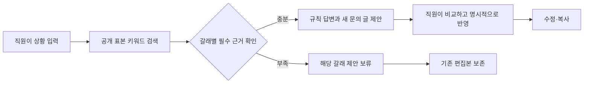

# 직원 업무 도우미 · Employee Assistant

직원이 장비 정책을 확인하고 문의 글을 준비하는 로컬 웹 앱이다. 공개 정책 표본을 검색해 **답할 수 있는 내용과 아직 확인하지 못한 내용을 나누고**, 직원이 직접 고친 글을 보존하면서 새 제안을 선택적으로 반영한다.

현재 지원하는 장면은 **재택용 모니터 구입과 느려진 회사 노트북 교체를 함께 문의하는 경우**다. 검색어·근거 역할·답변 문구는 수동 규칙으로 정한다. 실제 LLM/API 호출, 자유 질문 해석, 임베딩·벡터 검색은 연결하지 않았다.

**2026-09-26 개발 일시정지:** 현재 로컬 검토 결과를 보존하고 회고한다. 새 기능·조사·실험은 자동 재개하지 않는다. 모델/API 비교는 계속 보류한다.

[실행하고 한 문의 따라 해 보기](#try-one-inquiry) · [저장·복원 범위](#draft-resume) · [검사 실행](#검증)

## 실제로 동작하는 흐름



- **A · 정책 읽기**에서는 답과 이번 요청에서 실제로 회수한 원문을 함께 읽는다. **B · 문의 작성**에서는 문의 글을 넓게 펼쳐 수정한다.
- 노트북 핵심 절을 검색 자료에서 제외하면 모니터 결과는 유지하고 IT의 새 제안만 보류한다. 검색된 문서가 있다는 이유만으로 필요한 근거가 모두 있다고 판단하지 않는다.
- 재직기간이나 구매 상태를 고치면 이전 제안을 반영할 수 없게 표시한다. 새 제안을 만들어도 작성 중인 글은 유지하며, **새 제안 비교하기 → 새 제안으로 바꾸기**를 선택했을 때만 교체한다.
- 늦은 응답은 현재 입력과 대조한다. 통신 실패·근거 부족·복구·A/B 이동도 편집본을 자동으로 덮어쓰지 않는다.
- 평소에는 편집한 글을 바로 복사한다. 입력·근거가 달라졌거나 검색 중·연결 실패로 다시 볼 이유가 있으면, 현재 입력과 복사할 글을 함께 보여 준다. 돌아가서 수정하거나 **이 글 그대로 복사**할 수 있으며, 확인창을 연 뒤 상태가 바뀌면 다시 확인해야 한다. 이 확인은 문장 정확성이나 개인 자격을 보증하지 않는다.
- 개인 잔액·실제 승인·묶음 신청 가능 여부는 미확인으로 남긴다. 실제 신청·발송이나 내부 시스템 조회는 하지 않는다.

답별 참고 문서 보기·새 제안 비교·복사 직전 확인·초안 이어쓰기·미저장 이탈 확인은 공개 작업 브랜치 [`draft-resume`](https://github.com/junhyun-dev/employee-assistant/tree/draft-resume)에 있다. 로컬 검토를 마친 포트폴리오 코드이며, `main`의 첫 버전에는 병합하지 않았다. 서비스 배포는 하지 않았다. 저장·복원과 복사 흐름을 실제 브라우저에서 확인했으며, 읽을 수 없는 저장본의 보존·삭제 충돌 반례도 검증했다.

<a id="진행-중-새-제안을-반영하기-전에-비교하기"></a>
### 새 제안을 반영하기 전에 비교하기

**새 제안 비교하기**를 누르면 현재 편집글과 규칙으로 만든 새 제안을 나란히 읽을 수 있다. **현재 글 유지**로 닫거나 **새 제안으로 바꾸기**로 표시된 글 전체를 교체한다. 직접 추가한 일정 요청 등이 새 제안에 없을 수 있으므로 자동으로 두 글을 합치지는 않는다.

이전에도 변경 안내에 새 제안 전문을 보여 주는 경우는 있었다. 이번 변경은 이를 현재 글과 나란히 보고 유지·교체를 결정하는 일관된 경로로 연결했다. 비교창을 열거나 취소해도 글·저장본·클립보드는 바뀌지 않는다. 입력·편집글·검색 결과·제안 판본이 바뀌면 이전 비교로 적용하지 못하며, 확인 처리에서 다시 대조한다. 근거 부족으로 보류된 갈래는 새 제안을 비교·반영할 수 없다. 같은 글이어도 새 근거 판본을 채택할 때는 비교를 거친다.

A/B와 모바일에서 비교·취소·정확한 제안 적용, 오래된 확인 거부, 저장본 독립을 로컬 브라우저로 확인했다. 이 비교는 문장 의미나 개인 자격을 판정하지 않는다.

비교창은 두 글의 전문과 함께 **빠지는 텍스트를 취소선, 추가되는 텍스트를 밑줄로 표시**한다. `4년`을 `2년 10개월`로 고친 제안에서는 기간 변경과 직원이 덧붙인 ‘화요일 오전은 피해서 점검’ 요청의 누락을 구별해 볼 수 있다. 기존 두 전체 글과 유지·교체 선택은 남긴다.

[Google Docs의 수정 제안 안내](https://support.google.com/docs/answer/6033474?hl=en)는 변경 색과 삭제 취소선, 반영 전 미리보기를 설명한다. 이 부분을 참고했으며 실제 제품에 로그인해 동작이나 효과를 검증한 것은 아니다. 전체 전문만 두는 안은 대조 부담을 남기고, 자연어 변경 요약은 의미를 추측하므로 이번에는 문자적 차이 표시를 골랐다. 문장별 승인·자동 병합·변경 이력은 구현하지 않는다. 표시를 지운 순수 텍스트는 기존 두 글과 정확히 같고, 긴 입력은 계산을 제한해 잘리지 않은 전체 비교로 돌아간다. 실제 브라우저에서 취소 시 글·저장본·클립보드 보존, 정확한 교체와 모바일 조작을 확인했다. 반복 문구는 같은 최적 대응 중 앞에서 만난 기존 문맥을 우선한다. 대표 장면의 정책 문의 끝말은 유지되고, 덧붙인 일정 요청 전체는 빠지는 구간으로 표시되는 것을 실제 화면에서 확인했다. 공백을 포함한 텍스트 재조립과 계산 상한도 확인했다. 문자 정렬이 문장 의미를 이해하거나 모든 반복 문장의 의도를 알아낸다는 뜻은 아니다.


<a id="진행-중-답에서-참고한-정책-절로-이동하기"></a>
### 답에서 참고한 정책 절로 이동하기

답의 **참고 문서 보기**에서 해당 답의 ID와 이번에 회수한 자료가 겹치는 정책 절만 읽고, **전체 회수 문서 보기** 또는 **답으로 돌아가기**를 선택하는 경로를 로컬에 구현했다. B에서 들어오면 원래 답과 누른 버튼의 초점으로 돌아오며 편집글·저장본은 바꾸지 않는다. 현재 규칙이 연결한 자료를 보여 주는 기능이고 문장별 의미 정확성·개인 자격을 검증하는 기능은 아니다.

새 검색은 답별 선택과 복귀 위치를 초기화한다. 숨김 설정을 CSS가 덮어 버튼이 남던 반례를 수정하고, 문서 패널을 실제로 연 상태에서 화면과 Tab 이동에서 빠지는 것을 확인했다. 정상 답별 원문·B 왕복·편집글과 저장본 보존, 근거 누락·통신 실패·390px 화면도 로컬 브라우저에서 확인했다. 준비된 자료 밖의 ID 보충이나 부분 답 생성은 추가하지 않는다.

<a id="초안-이어쓰기--구현-중"></a>
<a id="draft-resume"></a>
### 초안 이어쓰기

결과적으로 직원은 마지막으로 저장한 입력과 편집글을 새로고침하거나 탭을 닫은 뒤에도 이어 쓸 수 있다. 저장본을 불러오는 일과 현재 정책에 맞는 글인지 확인하는 일은 구별한다.

- 사용자가 임시 저장을 눌렀을 때만 같은 브라우저 프로필·주소에 한 건을 저장한다. 자동저장은 하지 않고 저장 이후 수정은 미저장으로 표시한다. 마지막 저장 후 24시간이 지나면 복원하지 않으며, 앱이 다시 접근할 때 만료된 내용을 지운다. 앱이 닫힌 동안 정해진 시각에 디스크에서 삭제하는 기능은 아니다.
- 입력 사실과 편집글을 보존한다. 과거 답·원문·새 제안이나 ‘근거 확인됨’ 상태는 저장하지 않는다. 복원은 직접 선택한다. 성공하면 저장한 A/B 배치와 문의 종류의 편집글을 바로 보여 주고 초점을 옮긴 뒤, 현재 표본으로 다시 검색한다. 취소하거나 복원에 실패하면 보고 있던 화면을 유지한다. 검색 성공만으로 복원 글을 최신 제안으로 바꾸지 않으며, 새 제안을 명시적으로 반영하기 전까지 복사 시 재확인한다.
- 다른 탭은 저장본을 자동으로 가져오거나 현재 글을 교체하지 않는다. 저장·삭제 시 읽었던 판본과 현재 저장본을 같은 쓰기 작업 안에서 대조해, 다른 탭이 먼저 바꾼 내용을 덮거나 지우지 않는다. 충돌하면 현재 편집글을 보존하고 알려 준다.
- ‘새 문의’는 확인 후 현재 화면만 비우고, ‘저장본 삭제’는 저장본만 지우며 현재 편집글을 유지한다. 저장·삭제 실패를 성공으로 표시하지 않는다. 저장할 수 없으면 작성·복사는 계속할 수 있지만, 새로고침 뒤 복원되지 않을 내용을 안내한다.
- 같은 브라우저를 공유하는 사람도 저장본을 복원할 수 있다. 로그인·사용자별 보호·서버 저장은 제공하지 않으며 공유 브라우저에서는 저장하지 않는 편이 맞다. 이번 구현·검수에는 공개 표본과 합성 직원 정보만 사용한다.

브라우저 저장의 판본 비교와 변경은 IndexedDB 트랜잭션으로 묶었다. [MDN의 트랜잭션 설명](https://developer.mozilla.org/en-US/docs/Web/API/IDBTransaction)을 참고했으며, 성공 표시는 실제 완료 뒤에 하고 실패 시 편집 중인 글은 남긴다. 손상된 값·지원하지 않는 저장 형식은 현재 입력에 섞거나 자동 삭제하지 않고, 명시적으로 버리기 전까지 저장본을 보존한다. 지원하는 형식에서 만료를 확인한 내용만 자동으로 지운다. 복원 중 새 편집이나 새로 시작이 발생하면 늦게 도착한 저장본을 현재 글에 적용하지 않는다. 내용의 안전한 대조가 불가능한 낯선 형식은 삭제도 거부하며, 형식 변환·복구 도구는 제공하지 않는다.

<a id="진행-중-미저장-변경을-두고-떠날-때"></a>
### 미저장 변경을 두고 떠날 때

잃을 입력·편집글이 있을 때만 브라우저의 떠나기 확인을 요청하는 동작을 로컬에 구현했다. 취소하면 현재 작업으로 돌아오고, 떠나기를 선택하면 마지막 명시 저장본만 복원할 수 있다. 자동저장은 하지 않는다. 일반 편집 뒤 확인·취소 보존, 저장 성공 뒤 확인 해제, 미저장 수정을 버리고 마지막 저장본을 복원하는 경로는 실제 Chromium에서 확인했다.

**첫 정책 검색 실패 → 저장글 복원 → 재검색 성공 → 저장본만 삭제**에서도 화면에 남은 글은 잃을 수 있는 내용으로 다룬다. 뒤늦은 검색 결과가 복원글을 기본 예시로 잘못 분류하던 반례를 수정했다. 새 문의가 자동으로 채우는 초기 내용만 기본값으로 삼으며, 첫 조회가 실패하거나 아직 대기 중에 복원된 글은 이 기준으로 승격하지 않는다. 두 경로에서 실제 브라우저 확인창의 취소 후 글 보존을 직접 확인했고, 떠나기를 선택하면 새로고침을 허용하되 삭제된 저장본을 되살리지 않는 것도 확인했다.

성공한 저장·복원과 같은 내용이나 단순 화면 이동에는 경고하지 않는 기준을 유지한다. [브라우저 안내](https://developer.mozilla.org/en-US/docs/Web/API/Window/beforeunload_event)에 따라 확인 문구는 브라우저가 정하며 모바일 강제 종료 등에서는 표시를 보장할 수 없다. 임시 저장을 대체하는 기능은 아니다.

## 실행

Python **3.10 이상**과 브라우저가 필요하다. 앱 런타임은 Python 표준 라이브러리만 사용한다.

검토된 전체 흐름은 `draft-resume` 브랜치에서 실행한다.

```sh
git clone --branch draft-resume --single-branch https://github.com/junhyun-dev/employee-assistant.git
cd employee-assistant
python3 -m employee_assistant --port 8767
```

이미 해당 브랜치가 있는 로컬 폴더에서는 마지막 실행 명령만 사용한다.

브랜치를 지정하지 않고 clone하면 첫 버전인 `main`을 받는다. **아래 복사 확인·임시 저장·텍스트 차이 비교까지 보려면 위의 `draft-resume` 실행법을 사용한다.** 복원 직후 저장한 글의 편집 위치로 돌아오며, 재검색이 늦게 끝나도 그 사이 다른 입력칸이나 화면으로 옮겼다면 초점을 되가져오지 않는다. 이 복귀 경로도 로컬 브라우저에서 확인했다.

브라우저에서 <http://127.0.0.1:8767/>을 연다. 서버는 `127.0.0.1`에만 바인딩하며, 실행 시 외부 모델이나 정책 사이트에 요청하지 않는다. 참고 문서 링크를 직접 열면 외부 GitLab 페이지로 이동한다.

‘검색 자료 확인’의 **노트북 핵심 표본 제외** 버튼으로 부분 근거 누락을 확인할 수 있다. 이는 고정 표본의 일부를 제외하는 개발 확인 동작이며 실제 정책 부재나 신청 거절이 아니다.

입력·문의 글은 기본적으로 브라우저 메모리에만 있다. **지금 글 임시 저장**을 누른 경우에만 같은 주소·브라우저 프로필에서 마지막 저장본 한 건을 24시간 안에 명시적으로 불러올 수 있다. 저장 이후 수정한 내용이 있으면 지원하는 브라우저에서 새로고침·이탈 확인을 요청한다. 떠나기를 선택하면 그 수정은 사라지며, 확인이 뜨지 않는 종료도 있어 직접 저장이 필요하다. 서버 저장·계정·대화 이력은 없다.

<a id="try-one-inquiry"></a>
## 한 문의를 처음부터 이어 써 보기

위 명령으로 서버를 켜고 <http://127.0.0.1:8767/>을 연다. 종료는 터미널의 `Ctrl+C`다. 나중에도 **같은 브라우저 프로필과 정확히 같은 주소·포트**로 실행해야 저장본을 찾을 수 있다. 다른 포트나 `localhost`는 별도 저장소다. 자동 실행 서버나 외부 모델은 필요하지 않다.

처음 화면의 질문은 “재택용 모니터와 느려진 회사 노트북을 같이 바꾸고 싶은데, 같은 경비 신청으로 처리하면 돼?”로 고정돼 있다. 자유 질문을 새로 보내는 화면은 아니다. 아래 입력은 전부 합성 예시다. 이미 쓴 글이 있으면 보관할 내용을 먼저 복사하거나 저장한다. **새 문의**는 현재 화면만 초기화하며 이전 저장본을 지우지 않는다. 기존 저장본을 확인 없이 지워 예시를 시작할 필요는 없다.

| 누르는 순서 | 화면에서 비교할 내용 |
|---|---|
| **A · 정책 읽기**의 ‘내 상황’에서 **예시 정보 넣기** | 재직 `4년`, 느려진 상황 `지난주부터 화상회의 중`, 구매 상태 `아직 구매하지 않음`이 채워지고 새 제안을 만든다. 편집글은 아직 바뀌지 않는다. |
| **문의 글 열기 → IT 문의 → 새 제안 비교하기 → 새 제안으로 바꾸기** | `4년`을 포함한 규칙 문의 글이 들어간다. 참고한 문서 탭에서는 이번 검색이 회수한 절과 원문 링크를 볼 수 있다. |
| A의 재직 기간만 `2년 10개월`로 고친 뒤 **B · 문의 작성**으로 이동 | 새 제안을 만들거나 반영하지 않는다. ‘IT 문의’의 편집글에는 아직 `4년`이 남는다. 끝에 `점검 가능한 일정을 알려 주세요.`를 직접 덧붙인다. A/B는 서로 다른 문의가 아니라 같은 입력·글을 보여 준다. |
| **문의 글 복사 → 돌아가서 수정** | 확인창의 현재 입력은 `2년 10개월`, 복사할 글은 `4년`이다. 취소하면 글과 클립보드는 그대로다. 편집글의 `4년`을 직접 `2년 10개월`로 고친 뒤 다시 복사하고 **이 글 그대로 복사**한다. 이 확인은 문장 정확성·자격 승인이 아니다. 브라우저가 복사를 막으면 선택된 글을 직접 복사한다. |
| **지금 글 임시 저장 → 새로고침 → 저장한 글 불러오기 → 확인창의 저장한 글 불러오기** | 저장한 글은 자동으로 펼치지 않는다. 명시 복원 후에는 직접 고친 문장과 `2년 10개월` 입력이 돌아오고, 글에 현재 근거 재확인이 필요하다는 안내가 남는다. 저장 뒤 추가한 수정은 복원되지 않는다. |
| B의 **답변과 문서 → 이 답의 참고 문서 보기 → 답으로 돌아가기** | 선택한 답에 연결된 이번 회수 정책 절을 A에서 읽고, B의 원래 답과 버튼 초점으로 돌아온다. 전체 회수 문서 보기로 다른 절도 볼 수 있다. 일반 3년 정책 안내와 직원의 실제 자격은 별개다. 검색 성공이나 복원만으로 글을 최신 제안으로 바꾸지 않는다. 새 제안 비교하기에서 두 글을 읽고 현재 글을 유지하거나, 새 제안으로 바꾸기를 선택한다. 교체할 때는 직접 편집한 문장도 바뀐다. |

저장 이후 문의 글 끝에 문장을 하나 더 적고 새로고침을 시도하면 미저장 이탈 확인도 볼 수 있다. 브라우저의 머무르기·취소를 선택하면 현재 글로 돌아온다. 떠나기를 선택하면 마지막 명시 저장본만 불러올 수 있다. 직접 고친 실제 글 대신 위 합성 예시로 확인한다.

같은 글로 한 갈래만 더 비교하려면 **노트북 핵심 표본 제외**를 누른다. 모니터 답은 남고 IT 새 답·제안은 보류되며, 복원한 IT 글은 고치거나 확인 후 복사할 수 있다. **전체 표본으로 확인**으로 돌아와도 편집글은 자동 교체되지 않는다. 이는 준비 표본 누락 실험이며 정책이 없거나 신청이 거절됐다는 뜻이 아니다. 로컬 서버 연결이 실패하면 실패 안내와 편집글을 남긴다. 서버를 다시 켜고 화면의 재시도를 선택할 수 있다.

A에서는 답과 출처를 왕복하기 쉬운지, B에서는 같은 글을 수정하면서 입력·미확인을 놓치지 않는지 비교한다. 이 경로는 앱 동작을 살펴보는 예이며 실제 직원의 사용성이나 모델 품질 평가 결과는 아니다.

## 구현 구성

| 위치 | 역할 |
|---|---|
| [flow.py](employee_assistant/flow.py) | 지원 문의의 키워드 검색, 갈래별 근거 역할 판정, 규칙 답·제안, 편집본 상태 |
| [server.py](employee_assistant/server.py) | 로컬 HTTP와 JSON 입력 경계, 정적 파일 제공 |
| [web/](web/) | A/B 화면, 입력 판본·응답 순서 처리, 편집·명시 반영·복사·저장/복원 확인 |
| [text_diff.js](web/text_diff.js) | 비교창의 두 글에서 삭제·추가 구간 계산, 공백 보존과 긴 입력의 전체 비교 전환 |
| [draft_store.js](web/draft_store.js) | 명시 저장 한 건의 형식·24시간 수명, 트랜잭션 내 판본 대조, 읽을 수 없는 저장본 보존 |
| [공개 정책 표본](data/gitlab-expenses-excerpts.json) | 출처·관찰 시각·추출 범위를 포함한 6개 부분 발췌 |
| [model_contract.py](employee_assistant/model_contract.py) | 향후 모델 비교를 위한 입력 조립·합성 반환 검사. 현재 UI의 실행 경로와 별개 |

복사 전 확인은 [app.js](web/app.js)의 `copyReviewReasons`가 현재 입력·제안·검색 상태에서 필요한 이유를 고르고, [index.html](web/index.html)의 `copyReviewDialog`가 입력과 복사할 글을 보여 주는 구조다. `openCopyReview`는 그때의 글과 상태를 보관하고, `confirmCopyReview`는 현재 `copyFingerprint`와 다시 대조한 뒤 보관한 글만 복사한다. 확인 버튼을 비활성화하는 표시와 실제 복사 함수의 대조를 함께 두므로, 확인 중 응답이 도착하거나 글이 바뀌어도 옛 확인을 사용할 수 없다. 이 비교는 화면 상태의 일관성을 확인하며 문장 의미는 판단하지 않는다.

동작의 약속이 달라지면 위 [실제로 동작하는 흐름](#실제로-동작하는-흐름)을 먼저 맞추고, 이 구조와 [브라우저 검사](tests/browser_flow.py)를 함께 고친다. 문구·배치만 바뀌는 경우에도 취소 시 편집글·클립보드 보존과 정상 즉시 복사는 유지할 기준이다.

`model_contract.py`는 직원 입력과 회수 원문을 지시문과 구별하고, 이번 입력 밖의 근거 ID·필수 갈래 누락·근거 부족에서 완성한 답·상태 변경 필드를 거부한다. 조립된 입력의 내용을 다시 해시해 판본 불일치도 잡는다. 검증된 반환도 편집본과 별개 제안이다.

이 검사는 **구조와 근거 ID 포함 여부**를 확인한다. 문장이 원문 조건을 올바르게 해석했는지, 명령 주입에 모델이 저항하는지, 실제 생성 품질이 좋은지는 검증하지 않았다. 입력 해시는 일관성 검사이며 서명·인증이 아니다. 모델 공급자 연결과 모델 반환의 화면 적용은 아직 구현하지 않았다.

## 검증

표준 라이브러리만으로 단위·HTTP·계약 검사를 실행한다.

```sh
python3 -m unittest discover -s tests -p 'test_*.py' -v
```

현재 **18개 검사**에서 사실 정정 후 편집본 보존, 부분 근거 누락, 요청별 근거 ID, 잘못된 JSON 값, 정적 경로 경계, 오래된 모델 입력·제안 거부 등을 확인한다. 모델 계약 검사는 규칙 출력과 합성 반환을 사용한다.

브라우저 검사는 별도의 Playwright 환경이 필요하다. 가상환경에서 설치한 뒤 앱을 실행한 상태로 검사한다.

```sh
python3 -m venv .venv
# Windows에서는 .venv\Scripts\activate
. .venv/bin/activate
python3 -m pip install playwright
python3 -m playwright install chromium
python3 tests/browser_flow.py --base-url http://127.0.0.1:8767 --output test-results/browser
python3 tests/draft_resume_flow.py --base-url http://127.0.0.1:8767 --output test-results/draft-resume
```

브라우저 검사는 입력 정정·명시 반영·직접 편집·근거 누락과 복구·복사 내용·통신 실패·늦은 응답·HTML 형태의 입력·A/B 이동·모바일 가로 넘침을 확인한다. 복사 확인에서는 첫 클릭의 클립보드 보존, 취소, 표시한 글 그대로 복사, 확인 중 글 변경 거부와 복사 실패 시 수동 선택도 대조한다. 캡처는 지정한 결과 폴더에 생성하며 저장소에는 포함하지 않는다. 검사 통과는 실제 직원의 사용성 평가나 임의 질문의 정확도 측정이 아니다.

이어쓰기 검사는 마지막 저장본의 명시 복원, 미저장 수정 안내, 탭 사이 경쟁 저장·삭제, 늦은 복원 거부, 저장 실패, 읽을 수 없는 형식 보존과 삭제 확인, 현재 형식의 만료 처리를 대조한다. 복원 뒤 근거가 부족하거나 통신이 실패해도 편집글을 유지하는지 함께 확인한다. 저장소는 각 검사의 격리된 브라우저 프로필과 합성 입력을 사용한다.

## 구현과 작성 도움

이 저장소의 앱·검색 규칙·편집 상태 처리·텍스트 비교·검사는 이 프로젝트에서 작성했다. 개발에는 Codex AI 에이전트의 도움을 받았다. Main 에이전트가 설계 판단·코드 검토·실제 브라우저 대조를 맡고, Worker 에이전트가 구현과 회귀 검사를 수행했다. 사용자가 정한 서비스 목표와 범위에 맞춘 결과이며, 실제 직원의 사용성 수용이나 모델 생성 품질을 검증한 것은 아니다.

런타임은 Python 표준 라이브러리와 브라우저 기능을 사용하고, 브라우저 검사는 외부 오픈소스 도구인 Playwright를 사용한다. GitLab 정책 발췌는 아래의 별도 출처·허가문을 따른다. 문서 편집 도구의 사용 경험을 참고했지만 타사 앱 코드나 화면 캡처를 포함하지 않는다.

## 데이터 출처와 라이선스

[GitLab Global Travel and Expense Policy](https://handbook.gitlab.com/handbook/finance/expenses/)의 작은 고정 표본을 사용한다. 전체 정책·최신 정책 동기화·조직별 적용을 지원하는 데이터셋이 아니다. 직원 조건과 테스트 입력은 합성 예시이며 실제 직원 정보를 포함하지 않는다.

Handbook 원본 저장소의 MIT 라이선스와 출처에 따라 원저작권·허가문을 보존했다. 발췌·변환 범위와 고정 원문 링크는 [THIRD_PARTY_NOTICES.md](THIRD_PARTY_NOTICES.md)에 있다. GitLab과 제휴하거나 GitLab이 승인한 서비스가 아니다.

이 프로젝트의 독자 코드에는 별도의 소프트웨어 라이선스를 아직 부여하지 않았다. 제3자 자료의 라이선스를 프로젝트 전체에 적용한 것으로 해석하지 않는다.

## 현재 한계

지원 문의 유형, 한영 대응어, 필수 근거 역할과 답변 문구를 사람이 정한 기준선이다. 임의 질문의 의도나 근거 완전성을 자동으로 알아내지 않는다. 실제 LLM 생성·의미 평가, 여러 조직의 정책, 인증·권한, 서버·대화 이력 저장, 실제 발송과 운영 배포는 포함하지 않는다. 브라우저 임시 저장은 백업이나 계정별 보호가 아니며, 실제 직원의 보관 기간·공유 브라우저 수용은 확인하지 않았다.

같은 검색 결과에서 모델과 규칙의 문장을 비교하는 계획은 사용자 요청으로 보류했다. 외부 모델 연결 없이 초안 이어쓰기를 구현했으며, 모델 비교는 재개하지 않았다. 입력·반환 계약은 향후 비교용으로 유지한다.
